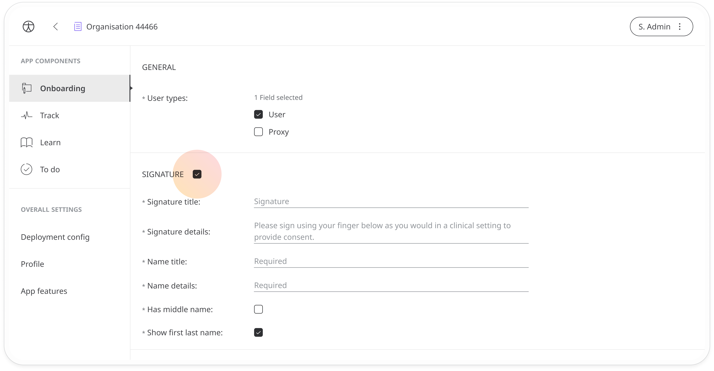
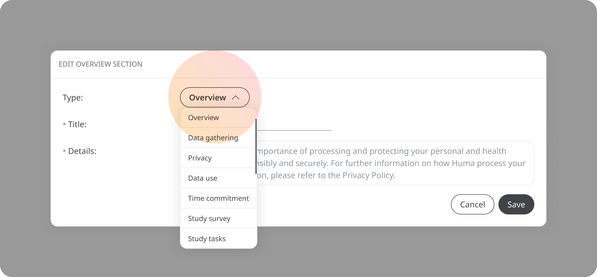

# Data consent
**User**: Super Admin, Huma Support, Account Manager, Organisation Owner, Organisation Editor

As the Huma platform processes patient data, it’s important to let them know what is done with that data along with the company privacy policy and terms and conditions. There are three Data Consent onboarding modules within the Huma platform that can be configured to the needs of the organisation. The information you enter here, as well as appearing in the onboarding module, will be accessible to users view links on their Profile page.  

Note that the [eConsent](./econsent.md) module is specifically for patients participating in clinical trials and is required for compliance.
## How it works​
When creating a new deployment, you can add the **Consent** module by selecting either **Consent or Legitimate Interest**, or by using the **Empty Consent Template** to start from scratch. Please consult the Legal team (legal@huma.com) to determine which is appropriate for your organisation.

Whichever option you choose, it will be listed in the onboarding modules as **Consent**. Consent modules are configured in English (as indicated by ‘UK’) but the template can be configured for other languages.

Click the **Edit✎** icon at the end of the row to configure the module.

> 📘 Note that the details may vary depending on the country. For the purpose of this guide, we will look at the configuration needed for EU regions who are regulated by GDPR guidelines.

- **General** - This section specifies the user who needs to consent. In this case, as it is the user’s data being processed, only **User** should be checked.

- **Signature** - Check this box if user signature is required. In the fields, you can edit the placement text which instructs the user how to complete the fields, or leave as the default. 

- If you want to include a middle name as part of the signature, check the **Has middle name** checkbox. 
- **Show first last name** - Ensure this is checked so user name and surname is requested.
- **Sections** - The sections listed in the consent module can be edited, removed and added to in order to configure the module to your specifications. Just click the **Edit✎** icon at the end of the row to change the **Type**, **Title** and **Details** of the section.

You can add more sections to your consent form if needed. Click the **Add section** button and complete the details in the pop-out window.

The sections you add to your consent policy is up to you. We have included some recommended sections to guide you. Select the ones you would like to include and add the relevant details. 

Recommended section types are as follows:
   
   - **Overview** - This usually includes a brief introduction that explains what this form is about
   - **Data gathering** - Tell users about how and why their data is collected 
   - **Privacy** - Tell users how their privacy is protected
   - **Data use** - Tell users how their data is used and explain why this is necessary
   - **Time commitment** - Inform users how much time commitment you expect them to put into their clinical trial. This might be a requirement for trial conditions  
   - **Study survey** - Tell users how they will be surveyed for the trial
   - **Study tasks** - Tell the user how many tasks they will be expected to complete as part of the trial
   - **Withdrawing** - Explain the terms of withdrawal from the trial
   - **Data sharing** - Tell the user what data will be shared and with who
   - **Data processing** - Indicate how user data will be processed
   - **Feedback** - Indicates how the user should submit feedback or how they will be contacted for their feedback
   - **Agreement** - This usually comes at the end of the consent form and asks the user to agree to everything contained within it. This section also has space for you to add a privacy policy statement and your terms and conditions.
- **Consent additional questions** – You can add more questions to your consent form if needed. Click the Add question button and fill in the details in the pop-out window.

**Related articles**: [eConsent](./econsent.md); [Identity verification](./identity-verification.md)
