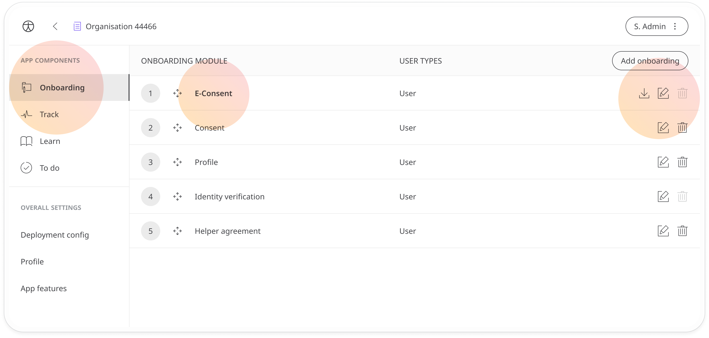
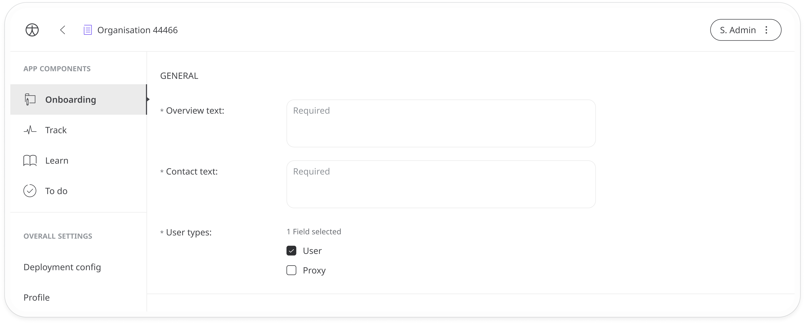
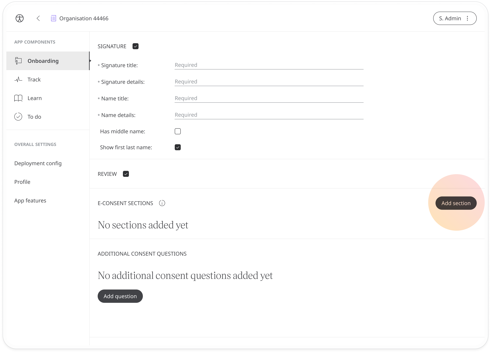
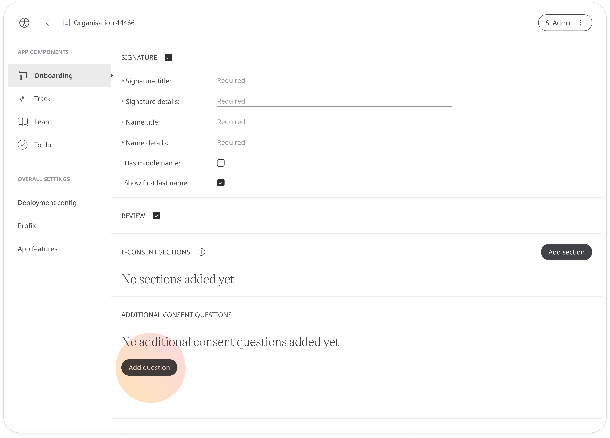

# eConsent
**User**: Super Admin, Huma Support, Account Manager, Organisation Owner, Organisation Editor

When collecting data for clinical research trials in a digital environment, participants who opt in must sign an electronic consent form to agree to how their data will be used. 
The eConsent module is used to build a **Patient information and informed consent** form, which must be read and consented to via signature by the patient so that they can participate in the trial.
## How it works​
In the **Onboarding** tab, the **eConsent** module will be added to the list by default. Just click the **Edit✎** icon to open the module details.

- **General** - Add a title to the consent form and some intro text. You should also add the contact details of someone they can contact for more details. 
- **User types** - Select **User** as it is the patient who needs to give their consent, even if the proxy is helping them to input their data. 

- **EConsent sections** - You can add more sections to your consent form if needed. Click the **Add section** button and complete the details in the pop-out window.

You’ll need to select the section type from the dropdown window, then add a title, image or video and some details.

- **Additional consent questions** - You can also add additional questions to your consent form. Click to **Add question** and fill in the details in the pop-out window.

Select the purpose of the data collection from the dropdown: **for research or for future studies**.

When including this module in the onboarding, ensure that it comes after the **[Data consent](hdata-collection/admin-portal/managing-deployments/configuring-the-user-onboarding/data-consent.md)** and **[Identity verification](data-collection/admin-portal/managing-deployments/configuring-the-user-onboarding/identity-verification.md)** modules.
## Patient experience
When first logging into the Huma App, patients will be taken through the privacy policy and terms and conditions and will be asked to consent. On receipt of the patient signature, Huma will generate an electronic informed consent (eICF) PDF.
Participants can easily withdraw their consent at any time without having to search for it or contact a customer support representative. 

**Related articles**: [Onboarding setup](data-collection/admin-portal/managing-deployments/configuring-the-user-onboarding/onboarding-setup.md); [Identity verification](data-collection/admin-portal/managing-deployments/configuring-the-user-onboarding/identity-verification.md)

