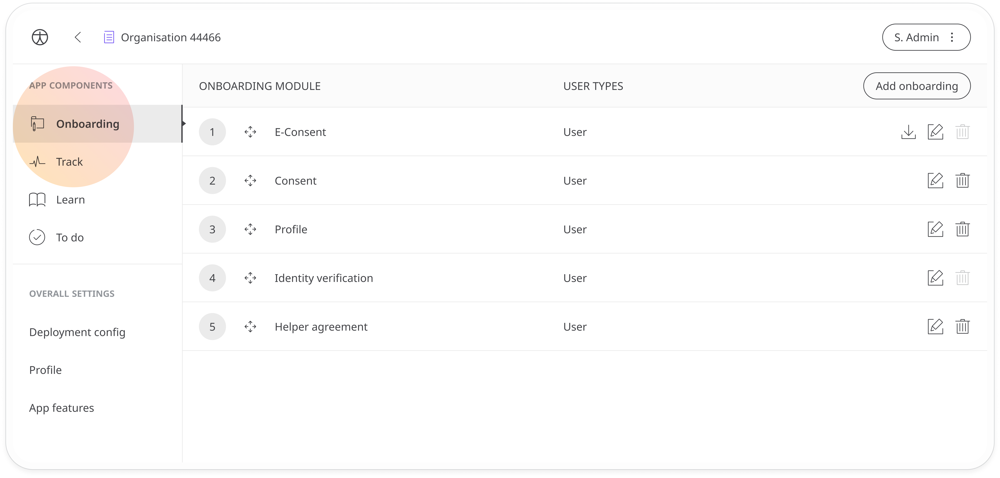

# Onboarding setup
**User**: Super Admin, Huma Support, Account Manager, Organisation Owner, Organisation Editor

Huma aims to deliver a seamless onboarding experience for patients when they first log into the app. The onboarding experience can be customised for each deployment by selecting which modules to add. Getting users to agree to your terms and conditions, verify their identity or agree to using a proxy are all things you can include in the onboarding process. 
## How it works​
Under **App Components**, select the **Onboarding** tab.

To add a new module, click **Add onboarding** and select from the list. 

Available options are:
- [Data Consent /Legitimate interest](./data-consent.md) - Ask users to consent to the Huma platform's privacy policy, EULA and terms and conditions.
- [Identity verification](./identity-verification.md) - Get users to confirm their identity using ID documents and photo verification
- [eConsent](./econsent.md) - Get consent from patients participating in clinical trials
- [Helper agreement](./helper-agreement.md) - Get consent from a proxy to enter data on the patient's behalf
- [Preferred units](./preferred-units.md) - Ask users which units of measurement they prefer to use 

Use the arrows🕂 to change the order in which the modules will be shown to the patient. It’s recommended to use the above order. In particular, identity verification must come before the eConsent module in order for the signature to be recognised as 23 CFR Part 11 compliant.

Click  at the end of the line to edit the units and  to remove modules from the list.

When you are happy with the configuration, click the button to **Save changes**.

As soon as users have completed signup, they will be asked to complete the assigned onboarding modules before being able to access the main app screens.

**Related articles**: [eConsent](./econsent.md); [Data Consent](./data-consent.md); [Helper agreement](./helper-agreement.md); [Identity verification](./identity-verification.md); [Preferred units](./preferred-units.md)

