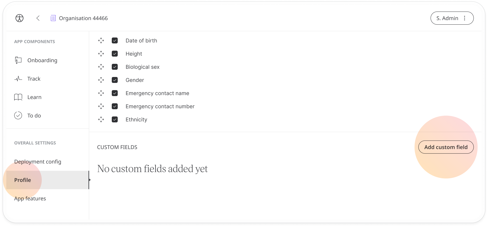
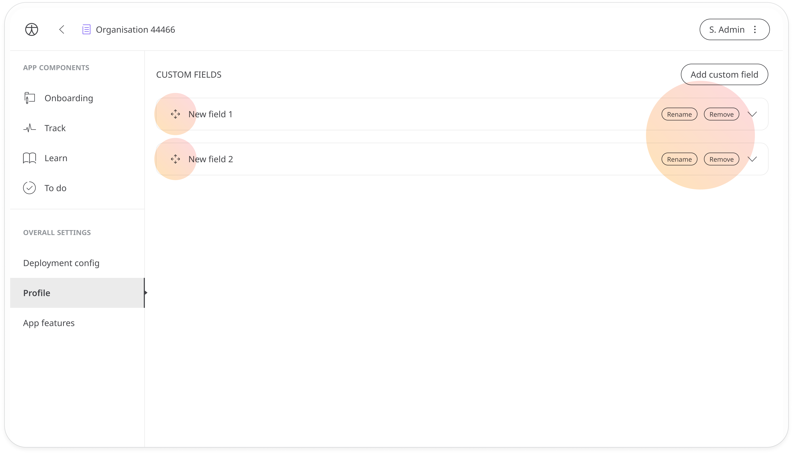

# Custom fields
**User**: Super Admin, Huma Support, Account Manager, Organisation Owner, Organisation Editor

When participating in Huma clinical trials or remote monitoring, every patient has to enter some profile details that are shared with their care team. Whatever the aims of your trial, you have the option to fully customise what profile details you request from your patients using the **Custom Fields** feature. 
## How it works
In the **Profile** configuration tab, under **Overall settings**, you can add custom fields. Scroll to the bottom of the page and click **Add custom field**. 

After adding a name for your field, click the down arrow to open up the rest of the form.

- **Type** - Choose between numerical and text depending on the type of information you are requesting
- **Onboarding collection text** - This is the question you want to ask the patient e.g. What is your Patient ID number?
- **Error message** - The message text shown to the patient if the answer they have entered is not valid (or the wrong length) e.g. The Patient ID must contain letters and numbers
- **Profile collection text** - The name for the field in the patient profile e.g. Patient ID
- **Length** - The number of expected characters for the answer e.g. 10 characters for the NHS number
- **Required** - Check the box to make this a required field
- **Show clinician header** - Check the box to show the field on the patient list in the Clinician Portal beside the patient name and ID
- **Clinician update** - Check the box to allow clinician to update
- **Regular expression** - Enter the code that describes what a valid entry looks like. Use [Regexr](https://regexr.com/) for help generating your regular expression code.

Click **Done** when you have completed the fields and continue to add more fields if needed. You can change the order afterwards using the **arrows✛** or remove the field and edit the name using the **Remove** and **Rename** buttons at the end of the row.

**Related articles**: [User profile](data-collection/admin-portal/managing-deployments/configuring-the-user-profile/user-profile-details.md); [Onboarding setup](data-collection/admin-portal/managing-deployments/configuring-the-user-onboarding/onboarding-setup.md)
