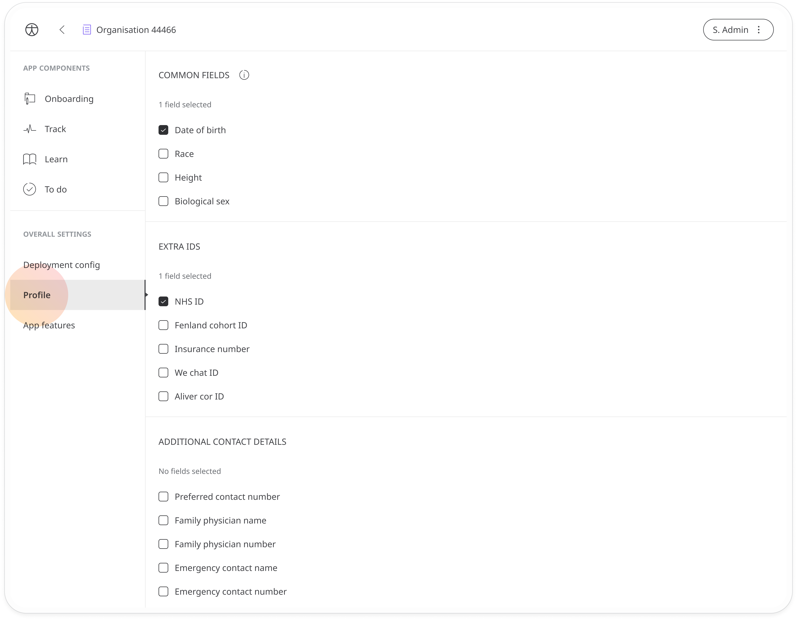
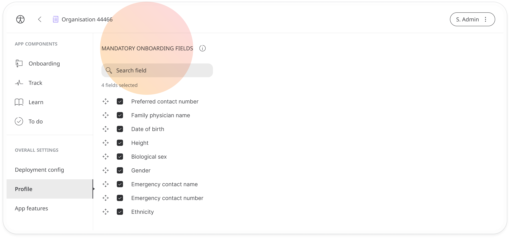

# User profile details
**User**: Super Admin, Huma Support, Account Manager, Organisation Owner, Organisation Editor

When participating in Huma clinical trials or remote monitoring, every patient has to enter some profile details that are shared with their care team. From Name, DOB, and medical ID, to gender expression, the profile details requested from the patient can be completely customised for each deployment. 
## How it works

When configuring a new deployment, select **Profile** from the side menu, under **Overall Settings** to configure the user profile data.

The patient will be asked to complete their profile details immediately following the onboarding modules and before landing on their homepage. Check the boxes to select as many fields as you require. 

### Common fields 
The first section has four options to choose from: 
- Date of birth
- Race
- Height 
- Biological sex 

### Extra IDs
In this section you can ask users for some additional identification details that might be useful for their care team:
- **NHS ID** - National healthcare ID for UK residents
- **Fenland cohort ID** - This is specifically for those patients participating in the Fenland study
- **Insurance number** - For medical insurance
- **WeChat** - Patients can also connect their healthcare data from their WeChat account. Providing their ID helps care teams to connect with that data.
- **AliveCor ID** - This is an ECG device that users can connect to their account via Kardia to provide readings. The user ID is useful for their care team to be able to track their readings.

### Additional contact details
It can be useful to get some additional contact details for patients and their primary caregivers. You can request these details in this section.

### Gender and Ethnicity
There are a number of gender and ethnicity categories that can be selected. These can also be renamed and customised depending on the needs of your study and cultural sensitivities (although the original name will always be used in exports).

### Clinician-only fields
This field appears in the patient profile, but only on the clinician side. If using the surgery date as a trigger for To dos, make sure this box is checked.

### Mandatory onboarding fields
This section lets you define which of the above fields you want to be mandatory. This means users will not be able to skip them. Review the modules you have added and ensure any of the data that is needed for these modules is made mandatory e.g. height and weight for BMI, biological sex for CVD score, gender and height for Peak flow, etc. As default, it is recommended that DoB and biological sex are mandatory in all cases.

You can reorder the options to define how they appear in the portal as well as the onboarding profile questionnaire.

**Related articles**: [Onboarding set up](../configuring-the-user-onboarding/onboarding-setup.md); [Custom fields](./custom-fields.md)
