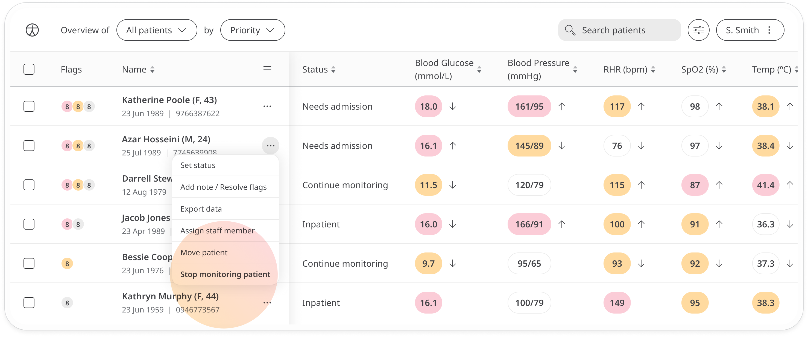
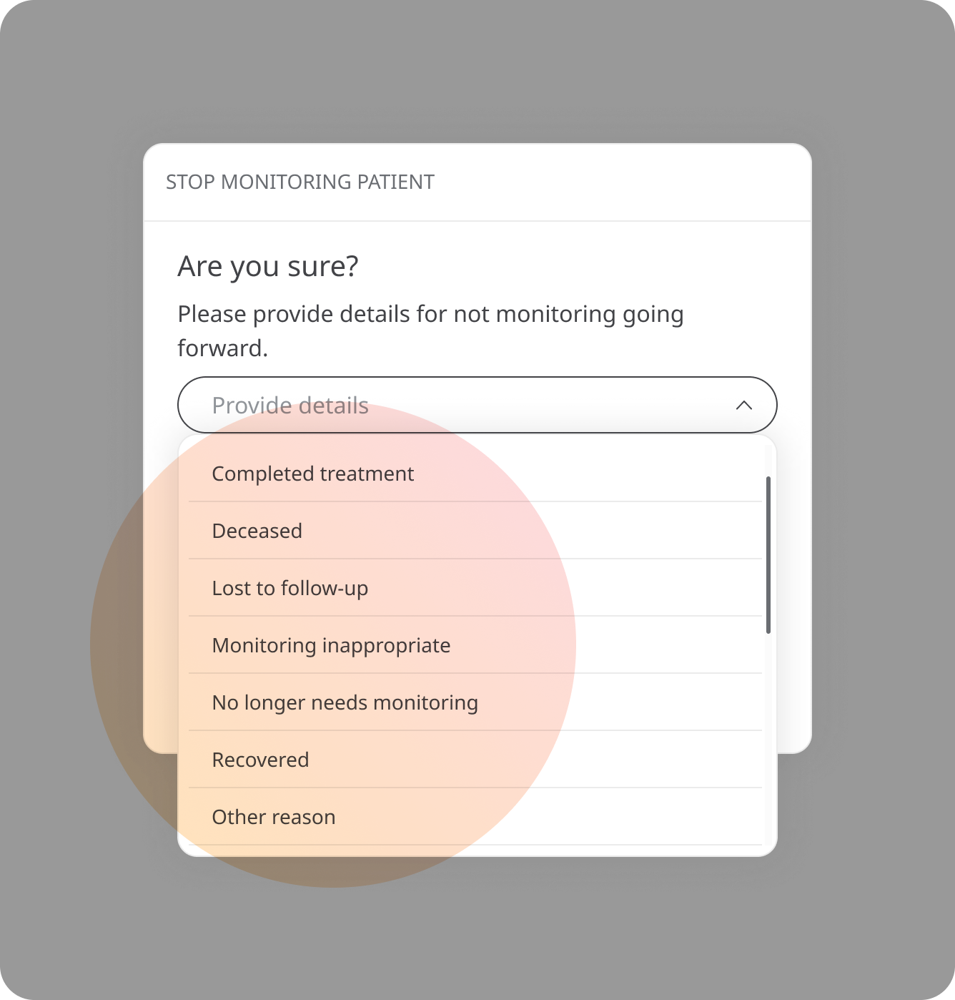
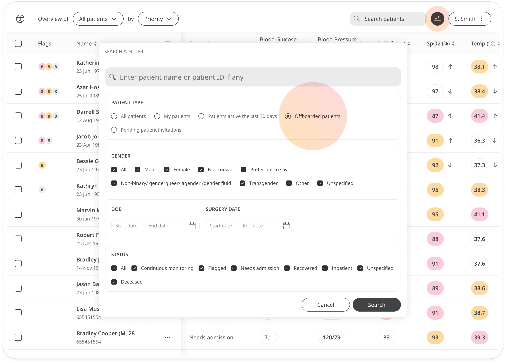
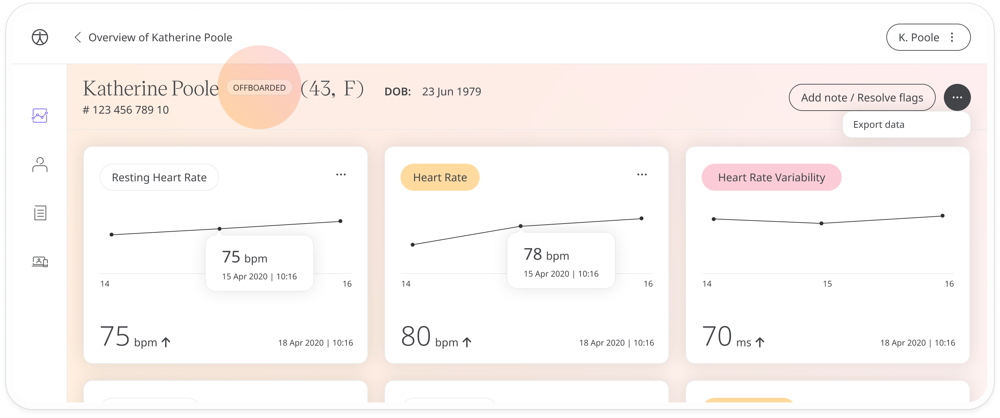
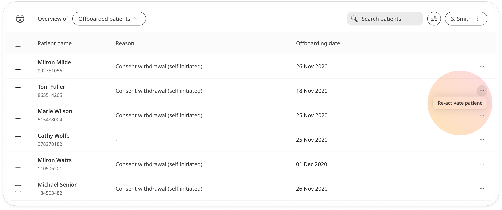

# Offboarding patients
**User**: Deployment Staff 

When a patient has reached the end of their journey with Huma - either by completing the trial, changing to another medical provider or another reason - they should be offboarded, meaning they will no longer have access to the Huma App and they will no longer be monitored in the Clinician Portal.

## How it works​
On the **Patient List**, find the patient you want to offboard. Open the menu at the end of the row and click **Stop monitoring patient**.

A pop-out window will open asking you to select the reason. First double check you have selected the right patient by making sure the right patient name is in the text. Next, open the dropdown to select your reason.

Select the reason that best describes why you want to stop monitoring the patient, or choose **Other reason** if the options you see are not appropriate.

The patient will be informed that they have been offboarded and will no longer have access to the Huma App. If they try to log in, they will see a message giving some of the reasons why they may have been offboarded. 

Although they are no longer being monitored, offboarded patients can still be found in the clinician portal by selecting **Offboarded patients** in the **Patient type** filters.

Users will still be able to see historic data on offboarded patients.

Offboarded patients can also be reactivated. Just open the menu at the end of the patient row on the patient list and select **Reactivate patient**.

Once reactivated, the patient will receive a notification and email to tell them that they once again have access to the app. 

**Related articles**: [Inviting patients](../roles-and-permissions/inviting-patients.md)
