# Filters and sorting the Patient List
**User**: Admin; Access Controller; Deployment Staff; Contributor; Organisation staff

The **Patient List** is the main dashboard of the Clinician Portal and where you can find all patients listed along with their vitals. This list can be filtered, sorted and customised according to the needs of the user. 
## How it works​
You can access the patient list filters via the circular icon ⬤ at the top-right of the portal.

This opens the filters in a pop-out window. Here you can see any current filters applied and edit them.

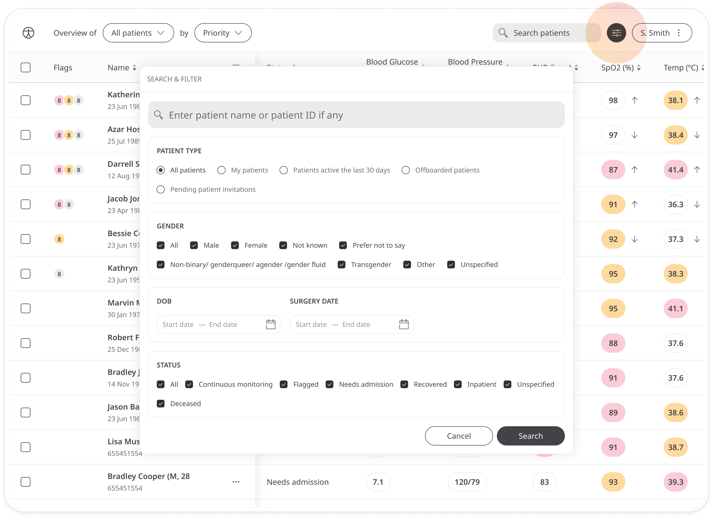

## Filters
Filters are split into categories: **Patient type** and **DOB** will always appear as filters as they are mandatory on all deployments. You may also have **Gender**, **Status** and **Surgery Date** if these items have been configured.

### Patient type 
- **My patients** - Only view patients where you are the assigned clinician
- **Patients active in the last 30 days** - This is useful if you want to see recent data
- **Offboarded patients** - Only view patients who have been offboarded and don’t currently have access to the platform
- **Pending patient invitations** - Only view patients who have been sent an invite but have not yet activated their account. This is useful for administrative staff looking to follow up on these patients

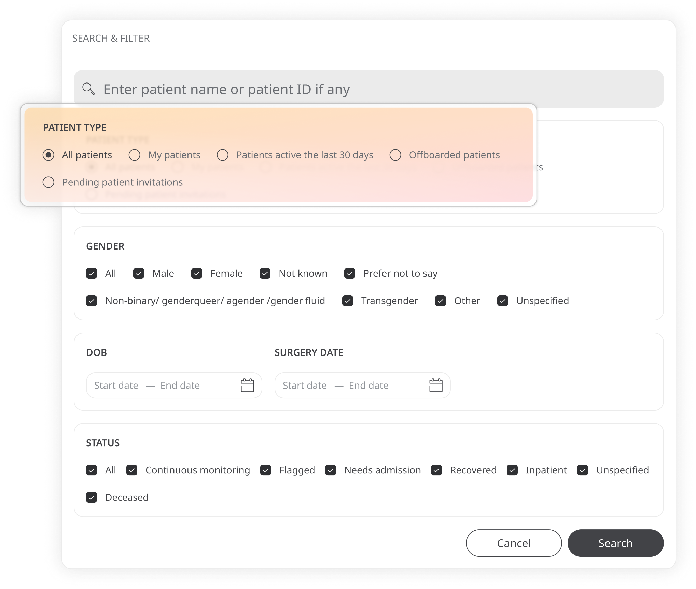

You can only select one option from the Patient type filters. The default view is to list **All patients**.
### Gender
The default view is to list all genders, but you can choose any combination of options. 

Because deployments can assign different gender categories depending on what terms are used in a specific organisation, the **‘other’** category includes all genders not covered by **male** and **female**.

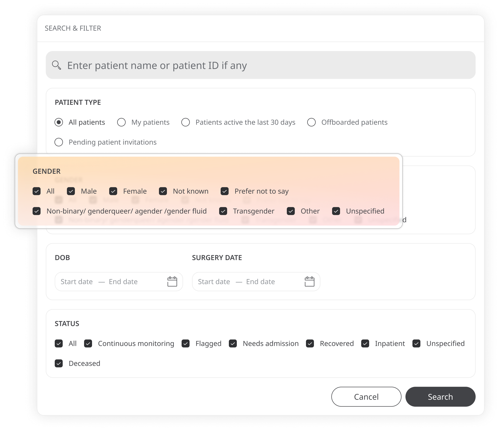

### DOB / Surgery Date
There are two date range filters that allow you to search for patients either by date of birth or by the date of their surgery.

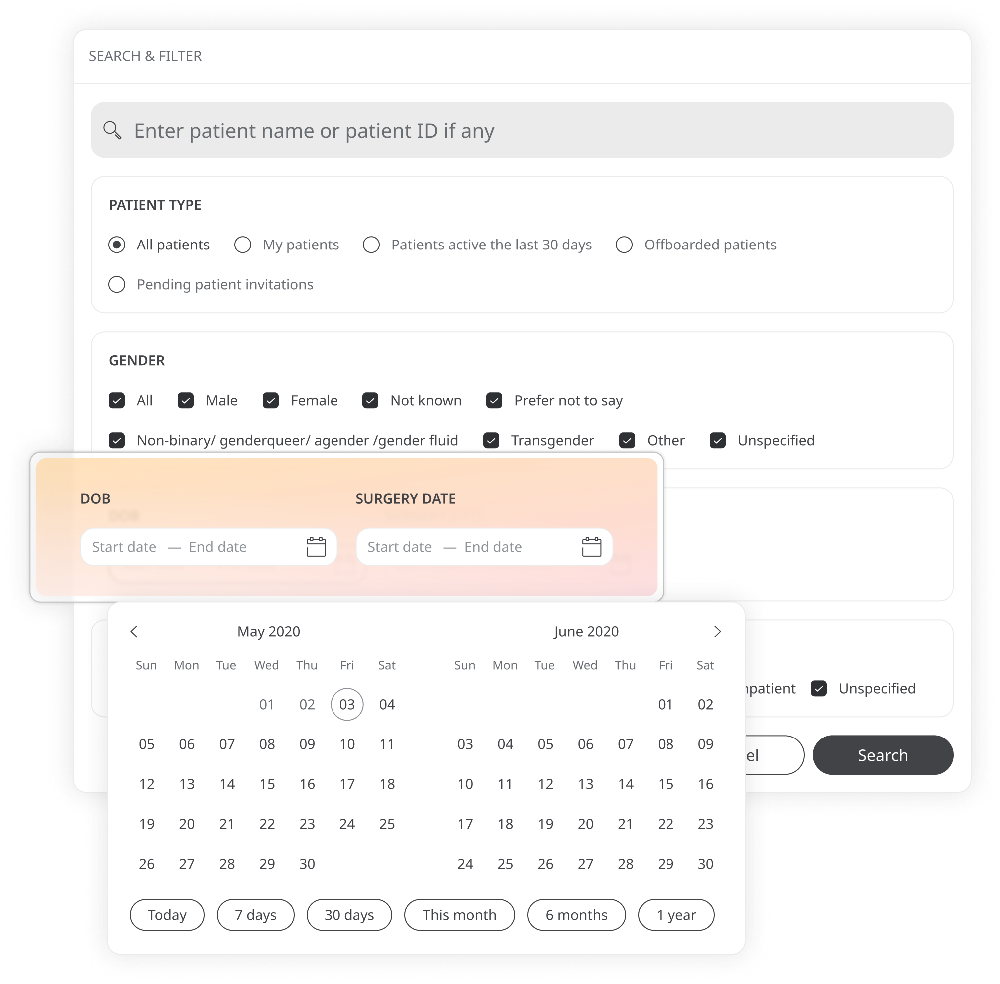

Just open the calendar and select a start date and an end date for your search window.

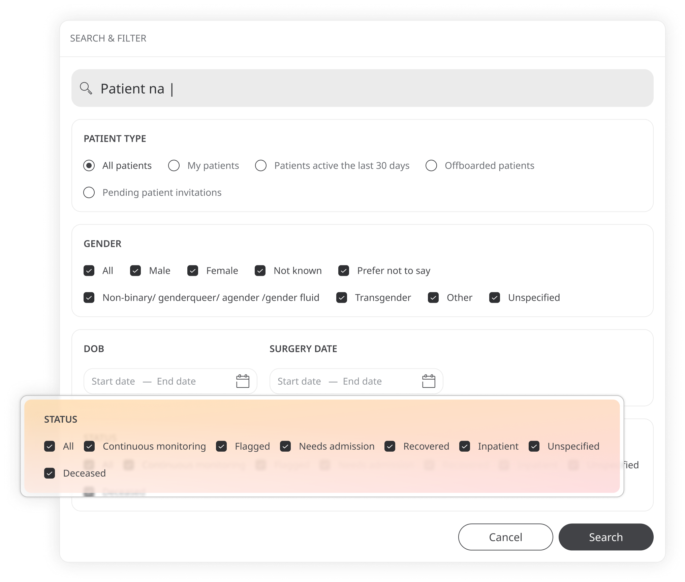

The calendar also lets you select dates quickly by giving you some default options: **Today, 7 days, 30 days, this month, this year**.

By default, all patients will be shown.
### Status
By default, all statuses are selected on the initial patient view, but you can narrow it down by removing specific statuses from the list. Statuses are set manually by members of the care team and include: **Continue monitoring, Flagged, Needs admission, Inpatient, Recovered, Deceased**.

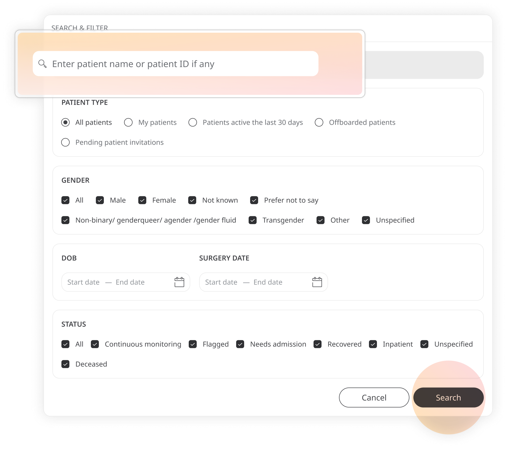

You can also use the search box to look for specific patients by entering a name or patient ID. Once you have set your filters, click **Search**.

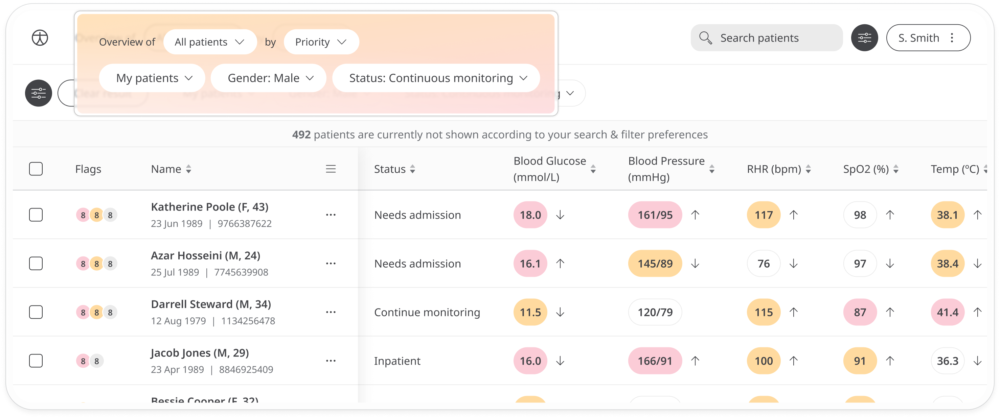

The list is now filtered to your specifications and you can see the filters you have set at the top of the patient list.

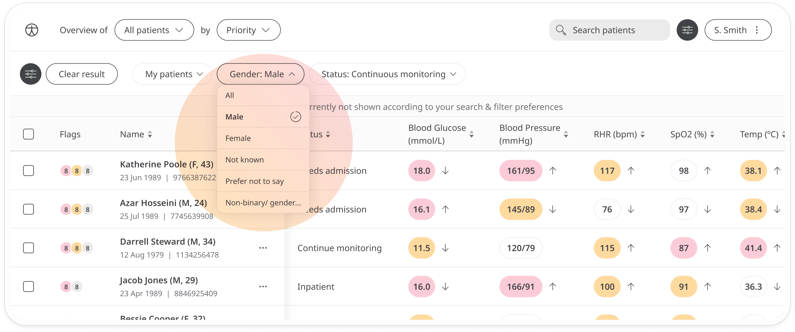

Once you have the filters you can manage them from the top of the patient list. Just click the filter dropdown to select a different option. 

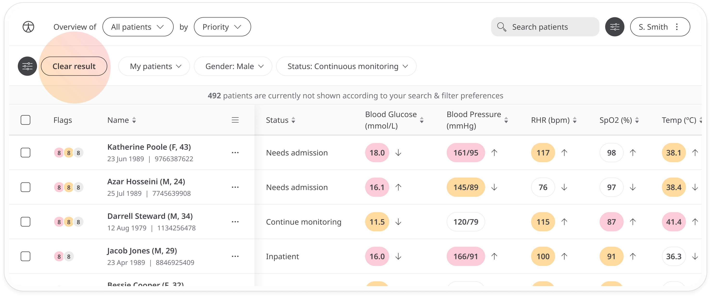

- The **Gender** and **Status** dropdowns allow you to select or remove options. You’ll see a check mark next to selected options. Just click an option again to remove it.
- The **Patient type** dropdown lets you select an alternative option.
- The **Dates** calendar lets you select alternative dates. 

If you want to enter a different search term, click the filters icon again. This is now located to the left of the filters.

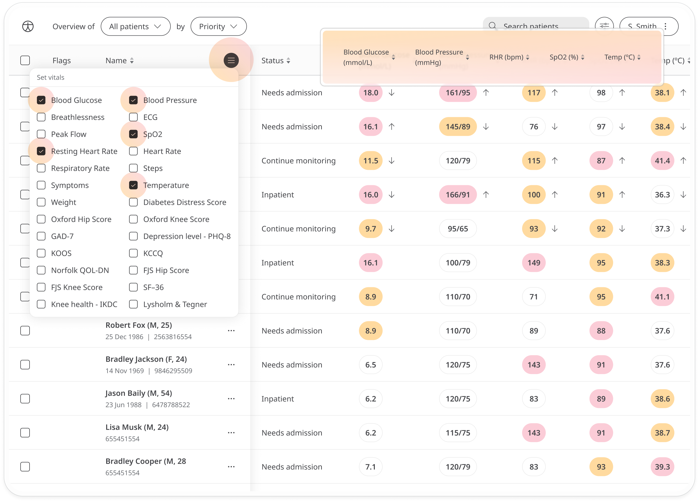

Click **Clear result** to remove all filters and start again.

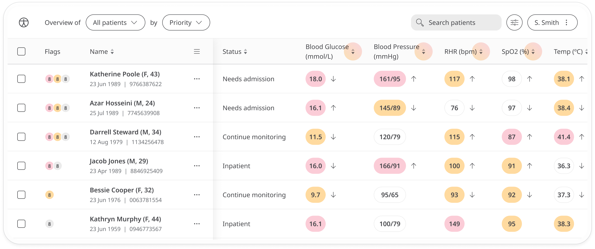

## Customising column headers
Besides filters, you can customise the information you see in the table by adding or removing columns.
Just click the **vitals icon ◯** to open the list. 

All checked items will show as columns on the table. Just uncheck any that you want to hide and check any you want to add again.

## Sorting
You can also sort the table using some of the vitals. Just click the arrow in the column header to sort patients by this metric and click it again to reverse the order.

Not all metrics allow sorting. Look for the arrow to see which ones have this option.

**Related articles**: [Patient status](./patient-status.md); [Resolving flags](./resolving-flags.md)
