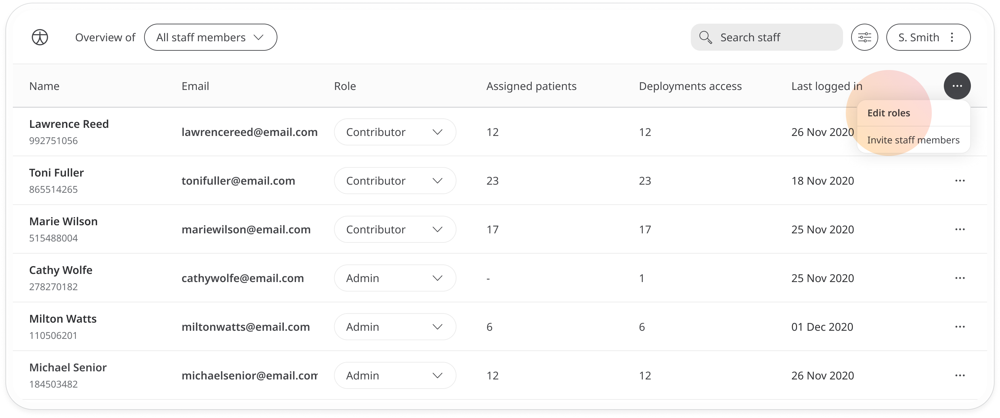
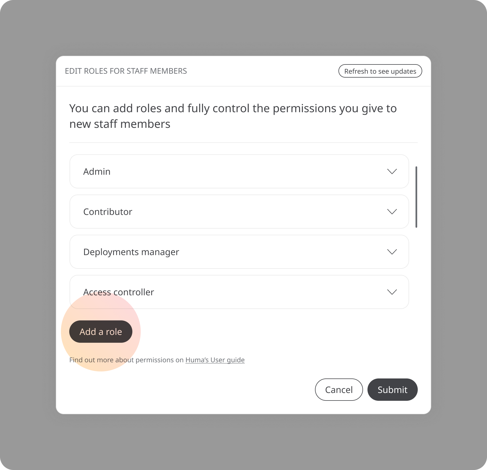
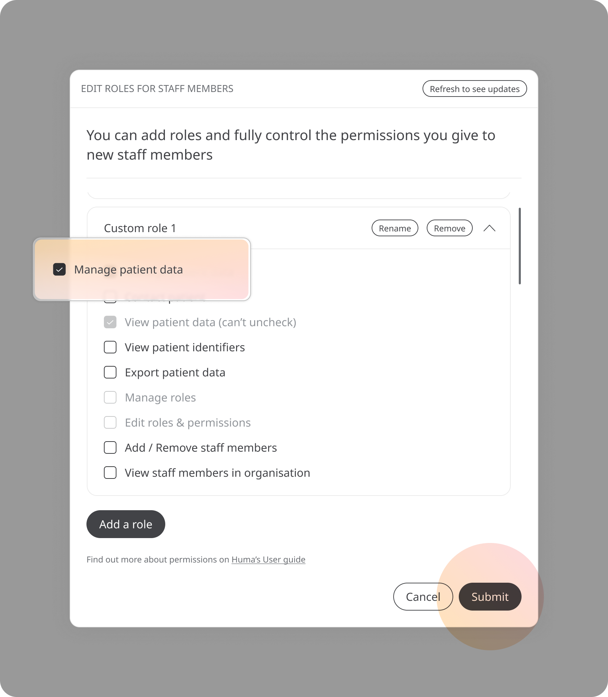
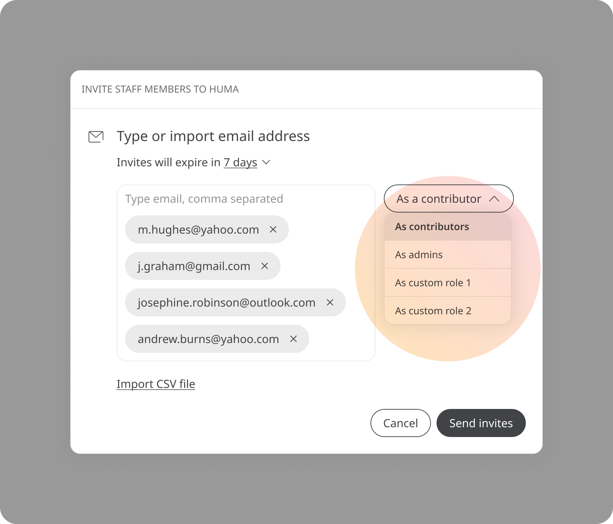

# Creating custom roles
**User**: Admin; Access Controller; 

The Clinician Portal is one easy-to-use interface for all care team and administrative users to easily view and track patient data, contact patients and/or to manage other users and their roles. The portal has a number of default user roles which can be assigned to users via invitation. 

However, if the default roles do not fully serve the needs of the Organisation, specific custom roles can also be created using any configuration of permissions.
## How it works
Open the dropdown menu at the top-right of the portal and select **Edit roles**.

Alternatively, in the **Invite staff members** window, click the **Add a new role** link.

The **Edit Roles** window will open, where you will be able to either edit a current role or add a new one. Click **Add a role** to create a new one.

The new role will appear at the bottom of the list. Click the **Rename** button to give your role a new name and check the permissions that you want to assign to this role by selecting them from the list.

The following permissions are available: 
- **Manage patient data** - This includes adding and removing patients, changing patient status, editing patient data, assigning patients to staff and offboarding patients.
- **Contact patient** - This includes scheduling and rescheduling patient calls and messaging and calling patients directly.
- **View patient data** - The user can view the patient’s submitted data points but not interact with them. This permission is mandatory so will be checked by default.
- **View patient identifiers** - Allows the user to see identifying patient information such as name, email and DOB.
- **Export patient data** - Allows the user to export patient data in json or csv.
- **Edit roles and permissions** - The user can edit and view custom roles.
- **Add/remove staff members** - The user can invite staff, assign roles and also remove them.
- **View staff in organisation** - Allows users to see who else is a staff member in the organisation and what role they have been assigned.
- **Offboard patients** - Allows the user to remove patient access to the Huma App through offboarding.

Once you have selected the permissions, click **Submit** to save the role.

Now, when you invite staff to the clinician portal, you will find the new role available on the dropdown.

**Related articles**: [Inviting staff and assigning roles](./inviting-staff-and-assigning-roles.md); [Default roles and permissions](./default-roles-and-permissions.md)

