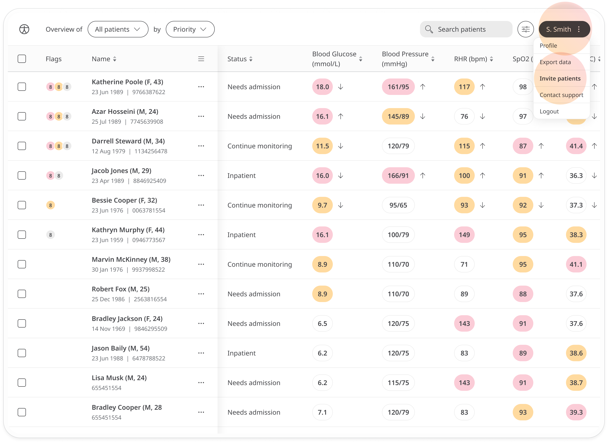
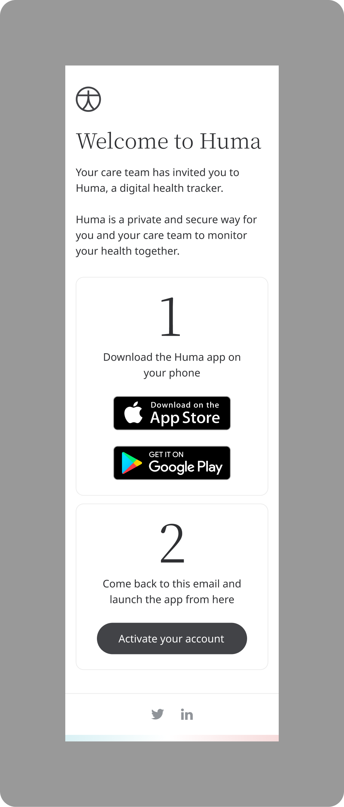
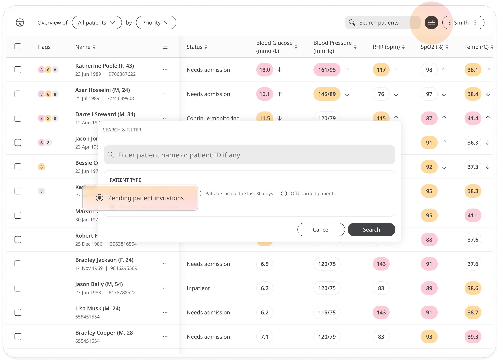
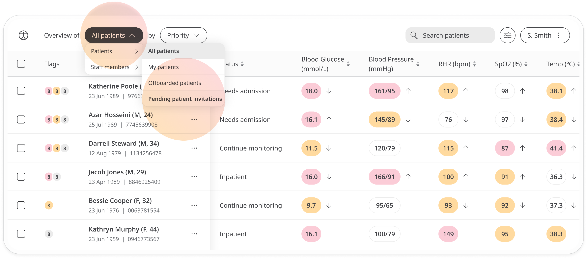

# Inviting Patients
**User**: Admin; Access Controller; Deployment staff; Organisation staff; Patients

Once the Clinician Portal is set up and ready to go, you need to invite patients. Patients can only get access to the App via an invitation. Any user with ‘manage patient data’ permissions can invite patients. 
## How it works​
Open the dropdown menu next to your name at the top-right of the portal and select **Invite Patients**.

In the pop-out window, enter the email addresses of the users you want to invite.

Set an expiry window for your invites by clicking the dropdown and selecting a duration. Options are 24 hours, 48 hours, 7 days and 1 year. Once the invitation link has expired, you’ll need to send another one.

Click **Send invites** to invite your patients. They will receive an email inviting them to a 2-step process. First, they will be asked to download the app, with links to the app stores.

Secondly, they will have a link that will let them create their account.

### Importing patient emails by csv
You can use the csv import feature to invite patients in bulk. Just list all your patients’ email addresses in the first column of a csv file and then click the **Import csv file** link and select the file. 

Once you have imported your patients, they will appear in the email field. Review them to check there are no errors and then click Send invites. 

### Inviting patients via a link
If you prefer, you can invite patients via a direct link. In the **Get Link** window, click **Copy link** and then simply send it to the user by email, text message, etc. 

When users click on the link, they will be sent to the App (provided they have it downloaded already) where they will need to enter their email address and then verify it.
You can also set an expiration date for the link by choosing a duration from the dropdown before you copy the link.
### Reviewing pending invitations
To see which patients have not yet responded to invitations by clicking the link, use the filters at the top right and select **Pending patient invitations** as the Patient type then click **Search**.

Alternatively, use the Overview filters and select **Patients >> Pending invitations**.

You will see all patients with pending invitations listed.
### Resending or deleting invitations
If you want to send out a reminder to patients who have not yet set up their account or whose invitations have expired, you can easily resend the invitation. On the list of pending patient invitations, open the menu at the end of the row and select **Resend invitation**.

On the same menu, you can choose to delete the invitation. This means the link will no longer work.

**Related articles**: [Default roles and permissions](./default-roles-and-permissions.md); [Creating custom roles](./creating-custom-roles.md); [Inviting staff and assigning roles](./inviting-staff-and-assigning-roles.md) 
