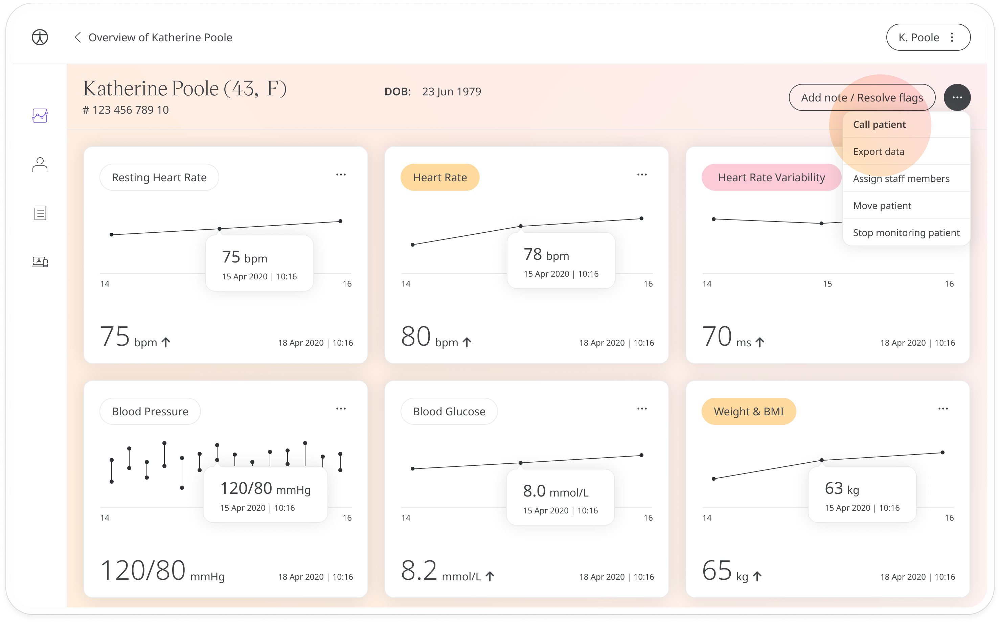
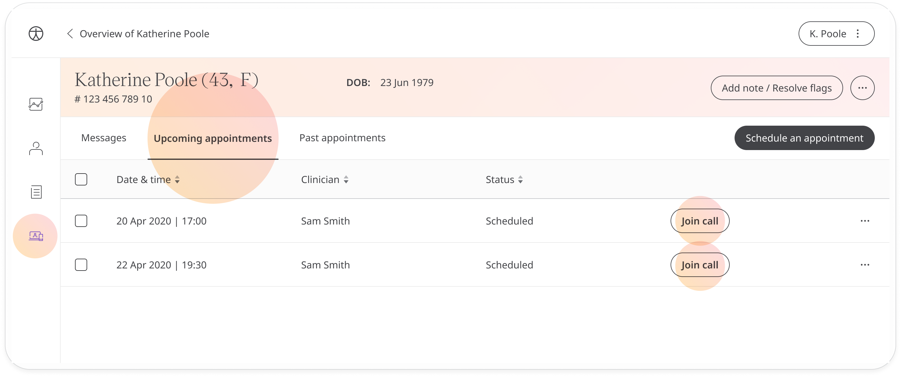

# Calling patients
**User**: Admin; Deployment Staff; 

The Huma experience connects clinician and patient through the portal’s telemedicine functionality. Clinicians can schedule video and voice calls with their patients or call them directly, without an appointment.

## How it works​
On the **Patient Overview** page, open the patient dropdown menu and select **Call patient**.

Click **Confirm** on the pop-up window and make sure your browser settings allow camera and microphone use. You can minimise the call window so you can take notes and view the patient’s data during the conversation. Mute the call with the microphone button and use the camera icon to enable or disable the video recording.

The patient will receive the call as a standard video or audio call. 

You can review your call history with the patient in the **Past Appointments** tab of the **Telemedicine** area of the Patient Overview. Unanswered attempts or other unsuccessful calls will not be stored.

If you have a call scheduled with a patient, you can choose to start that call at any time using the **Join call** button in the scheduled appointments tab.

## Missed calls
When a call on Huma does not connect, you will be provided with one of the following reasons: 
- Call declined
- No network detected
- No answer

The patient will receive a missed call notification which will give them the option to rebook the appointment at another time.

**Related articles**: [Messaging patients](./messaging-patients.md); [Scheduling appointments](./scheduling-appointments.md)
