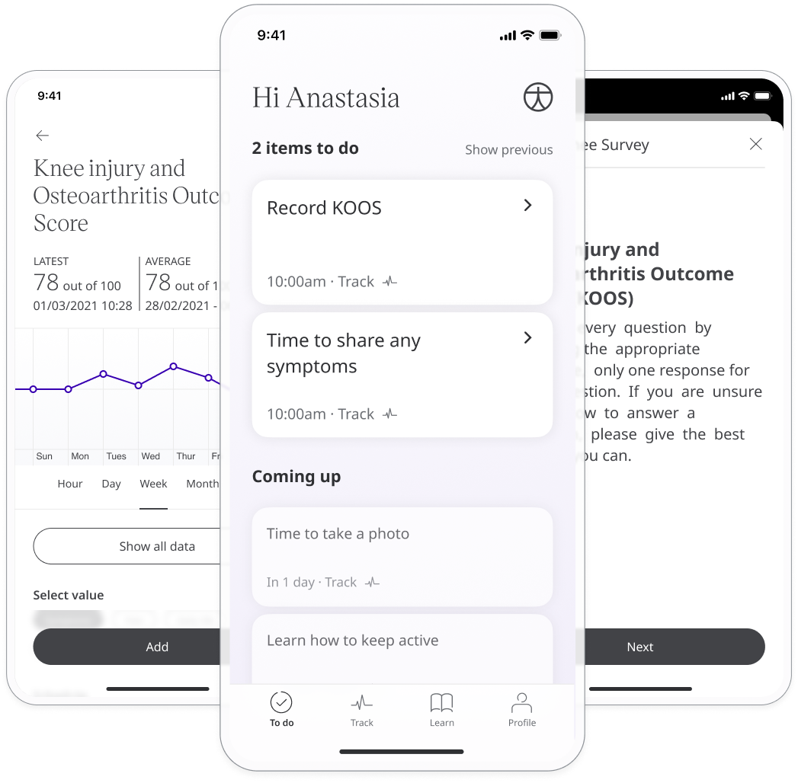
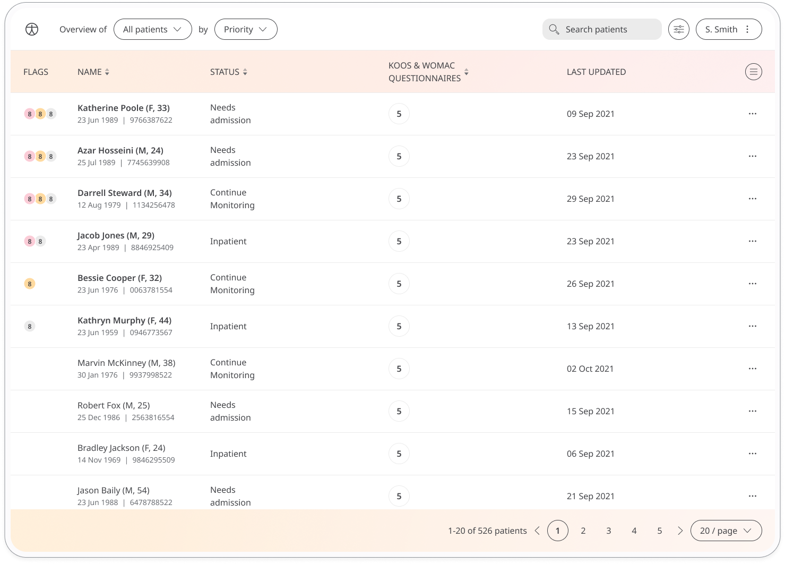
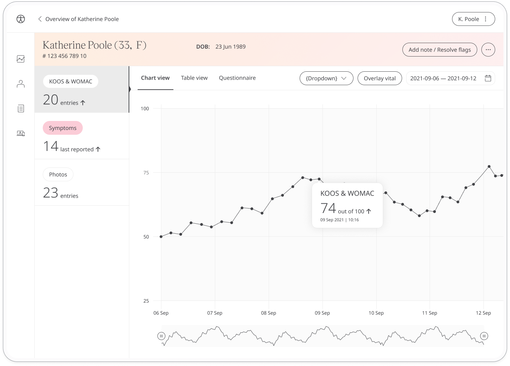

Good knee mobility in key to performing regular daily activities, such as standing, and walking. The Knee injury and Osteoarthritis Outcome Score (KOOS) questionnaire is intended for young and active patients. In addition, the Western Ontario and McMaster Universities Osteoarthritis Index (WOMAC) question is for those patients who have required total knee replacement. In both cases, patients record how they feel about their knees and that information is shared with their care team to gather insights for their ongoing care.

## How it works

Patients answer questions about the functionality of their knee on a subjective scale. Questions fall into the following categories: pain, symptoms, activities of daily living, sports and recreation, and quality of life. At the end of the questionnaire, patients are assigned a score out of 100.

To start, patients can select the KOOS/WOMAC module and click "Add" to start. From within the module, patients can view their progress in a graph and also access all their previous results. Daily, weekly, or monthly reminders can be set to help stay on track.

In the Clinician Portal, care teams will see the latest FJS Hip score for their patient, with concerning scores flagged for attention.

In the Patient Summary, care teams can view all historical data in graph or table form.

