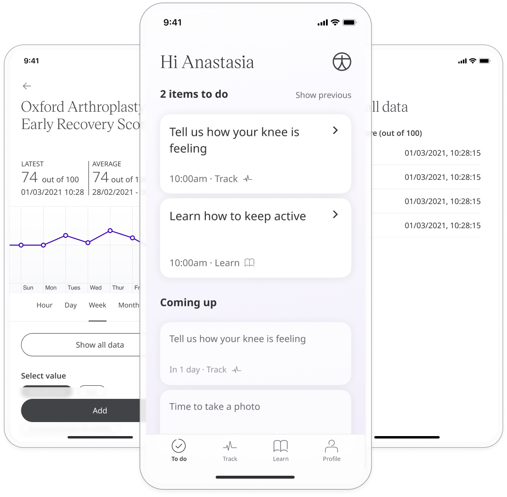
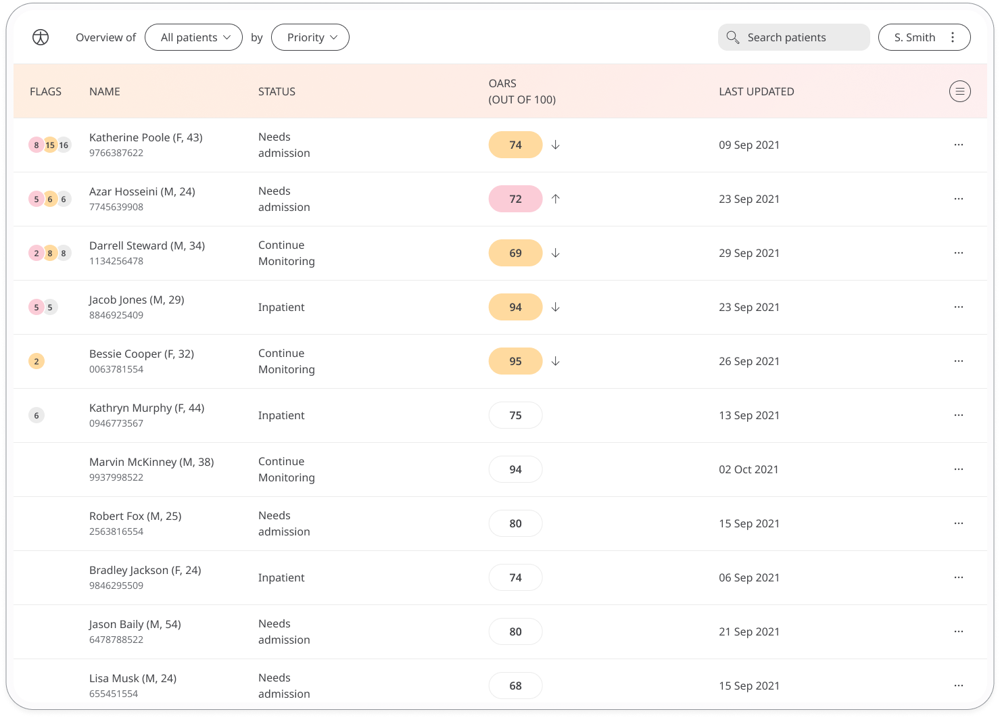
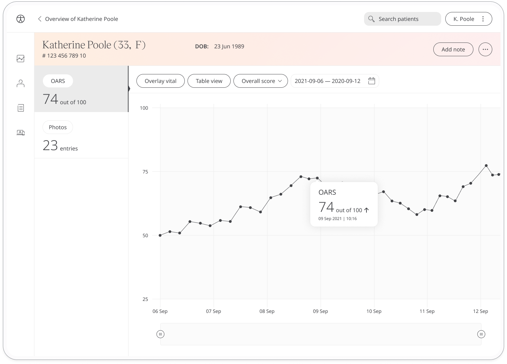

Post-surgery care is key to successful recovery from any operation. The Oxford Arthroplasty Early Recovery Score (OARS) asks the patient about their post-surgery progress to assess any quality of life improvement. Their feedback is shared with their surgeon in order to help with the delivery of ongoing care.

## How it works

Patients answer a series of questions about how they feel post-surgery. To start, patients select the OARS module and click "Add". For each question, they will choose from the following options:
- Strongly disagree
- Disagree
- Neither agree nor disagree
- Agree
- Strongly agree

At the end of the questionnaire, patients are assigned a score out of 100 which is shared with their care team. From within the module, patients can view their progress in a graph and also access all their previous results. Reminders can also be set to help stay on track.

In the Clinician Portal, care teams will see the latest Oxford Arthroplasty Early Recovery Score for their patient, with concerning scores flagged for attention.

In the Patient Summary, care teams can view all historical data in graph or table form.

