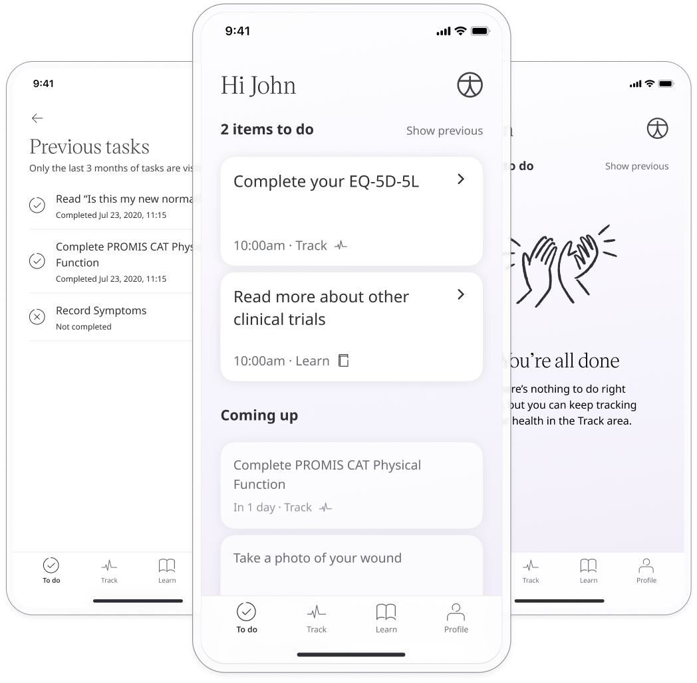
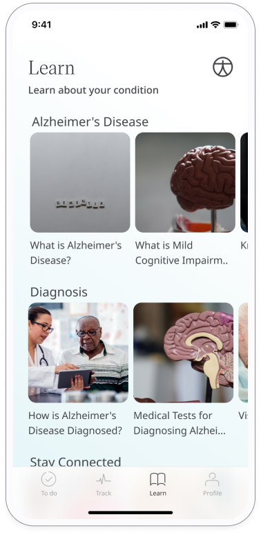
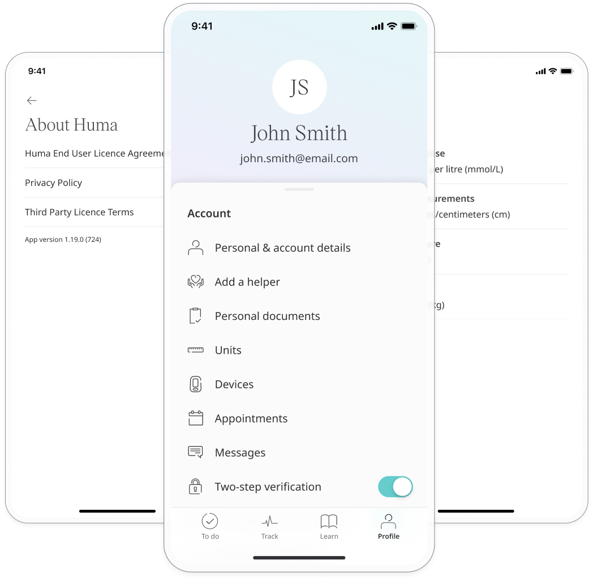

# Navigating the App
**User**: Patient, Helper

The main objective of the Huma App is to give patients the ability to record their health data and self-observations so that these can be shared with care teams, helping them to manage their general health and specific conditions.

# How it works​

Depending on the app configuration, there will be up to four different areas, accessible via the navigation menu at the bottom.

The default homepage is usually the [To do/Timeline](../features/to-dos.md) page. This is where patients will see any actionable items assigned to them by the care teams, such as appointment request or modules pending data collection.

The [Track](../features/track-modules.md) page is where users can find a list of all their assigned modules and questionnaires. Patients can find information about the modules here and set specific reminders for entering their data. 

The [Learn](../features/learn.md) area provides further reading and insights to educate patients. Users can browse the content in the Learn area at any time and specific articles may be recommended to them by their care team. 

The Profile page is where users can find and [edit their personal data](./personal-information-account-settings.md), access [privacy and security settings](../features/data-privacy-and-security.md), invite helpers, access their [messages](../features/messages.md) and log out of the app.

**Related articles**: [Login and onboarding](./login-and-onboarding.md); 
