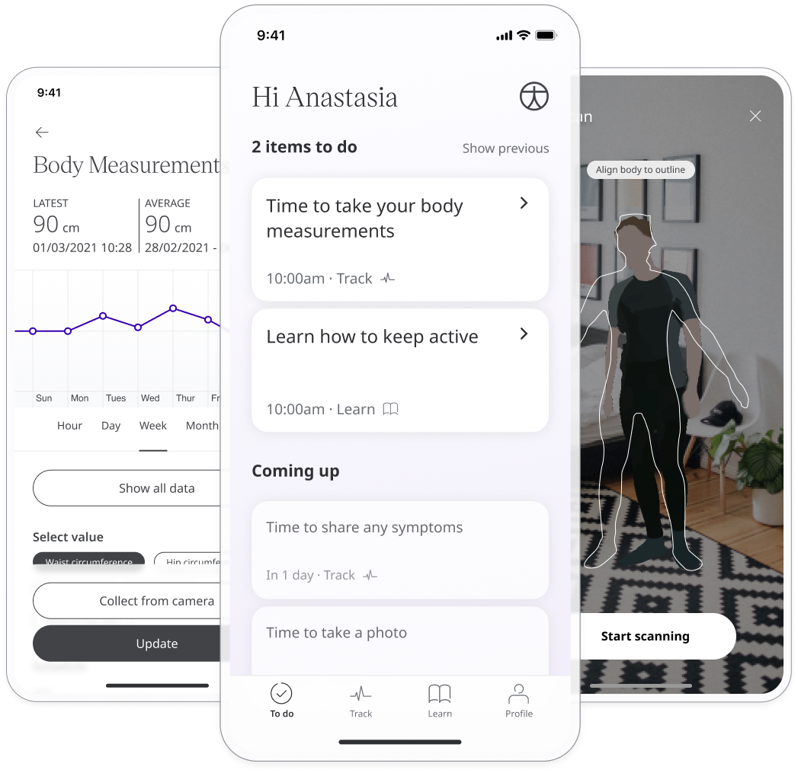

** Helping Patients make good lifestyle choices. **

The Body Measurement Module in Huma aims to take basic yet important vitals so that Patient can track their progress and understand their overall health over time.

## How it works

#### Waist circumference
Waist circumference is a good measurement to estimate the body fat content in a Patient’s midsection. It is a useful and simple screening tool for weight-related and metabolic health problems. This can be done using a measuring tape just above the belly button, where it is snug, but not tight, and take the measurement on an outward breath..

#### Hip circumference
Hip circumference is a useful measurement to help calculate the body fat content in a Patient’s midsection. When combined with other measurements, it is a useful screening tool to help calculate their risk of weight-related and metabolic health problems. This can be done using a measuring tape around the largest part of the hips — the widest part of the buttocks. 

#### Waist to Hip ratio
Waist-to-hip ratio (WHR) compares the measurements of your hip and waist to estimate the body fat content in the midsection. It is a useful screening tool which can help estimate the risk of diseases such as heart disease and diabetes. By using a ratio, WHR adjusts for different body shapes. This is calculated automatically from Hip and Waist circumference.

#### Visceral fat
Visceral fat measures the fat in and around the midsection, which plays an important part in protecting vital organs. Too much or too little visceral fat can cause long-term health problems. A balanced diet and regular exercise can help maintain the optimum level. This measurement is collected by scanning the body using the camera on the Patient’s phone.

#### Total body fat %
Total body fat is a measure of how much of your body mass is made up of essential body fat and storage body fat. These are essential for body function and too much or too little can cause health problems. A balanced diet and regular exercise can help maintain the optimum level. This measurement is collected by scanning the body using the camera on the Patient’s phone.

### Patients
In the Huma app, when onboarding, the questionnaire will prompt the Patient to complete fields relevant to this module, and in this case, the module will utilise height, weight, age, and gender in Body Measurements.

Patients can then select the Body Measurements module, and by pressing “Add” they can enter their waist and hip measurements in cm (centimetres).

The Patient can use the camera on their phone to scan themselves and determine Visceral Fat and Total Body Fat percentage. 

From the Body measurements module, select “Collect from camera” and the Patient will be taken through steps to scan themselves and collect all the data needed.

### Clinicians

This module helps Patients to understand their health and to help with decisions regarding their lifestyle therefore the data collected is not viewable from the Clinician Portal. 
