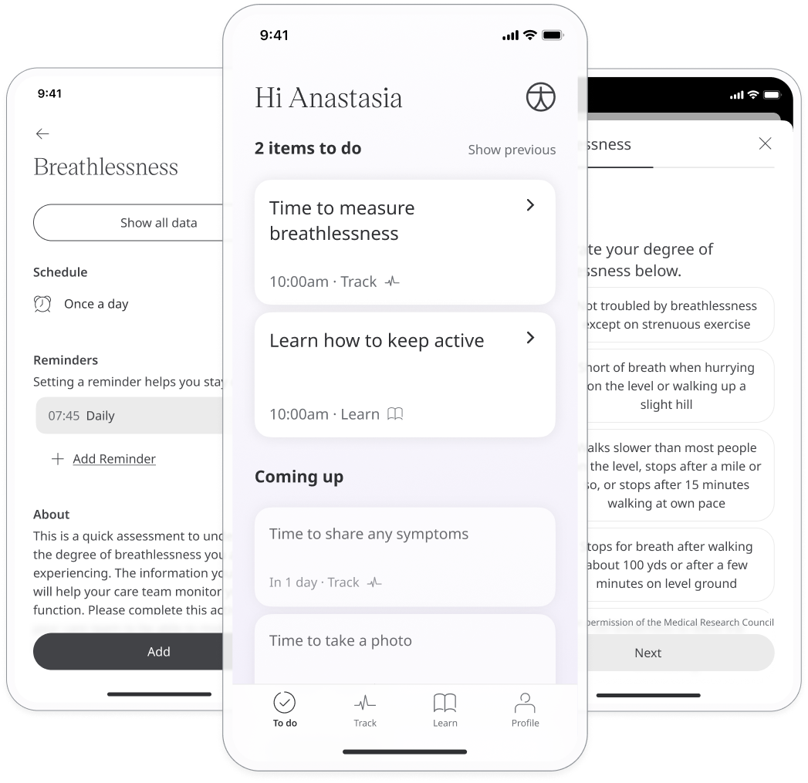
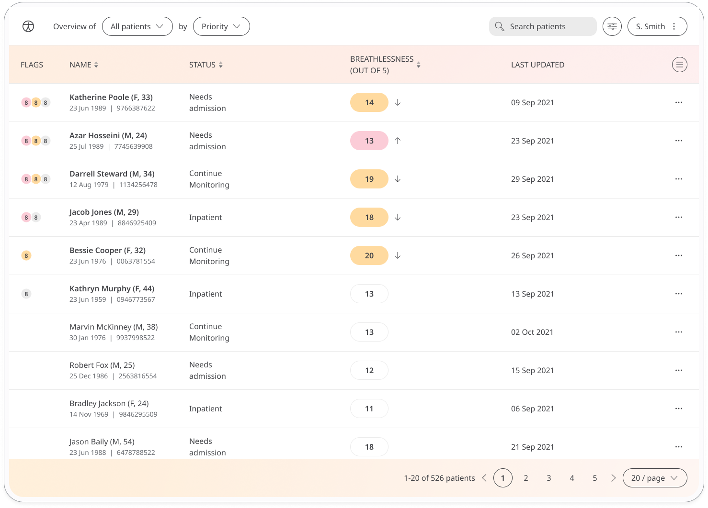

Shortness of breath can be caused by conditions such as asthma, chest infections, or from smoking but can also be a sign of something more serious. This module provides a quick assessment to understand the degree of breathlessness patients are experiencing. This information allows care teams to track lung function over time and provide insight or recommendations to patients.

## How it works

The Breathlessness module asks patients to answer a simple question; “How breathless are you when you are walking around or walking up stairs?”. Patients can choose from the following options:
- None
- Mild
- Moderate
- Severe
- Very Severe

Patients can view their historic breathlessness scores in a graph. In the Clinician Portal, care teams will be able to see the latest breathlessness scores from their patients and any concerning readings will be flagged. 

The Patient Summary displays a more detailed view of the patient's historic scores in graph or table form.

