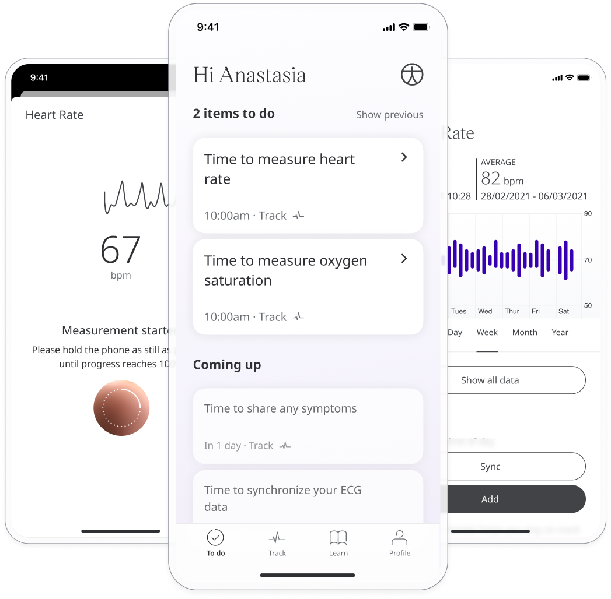
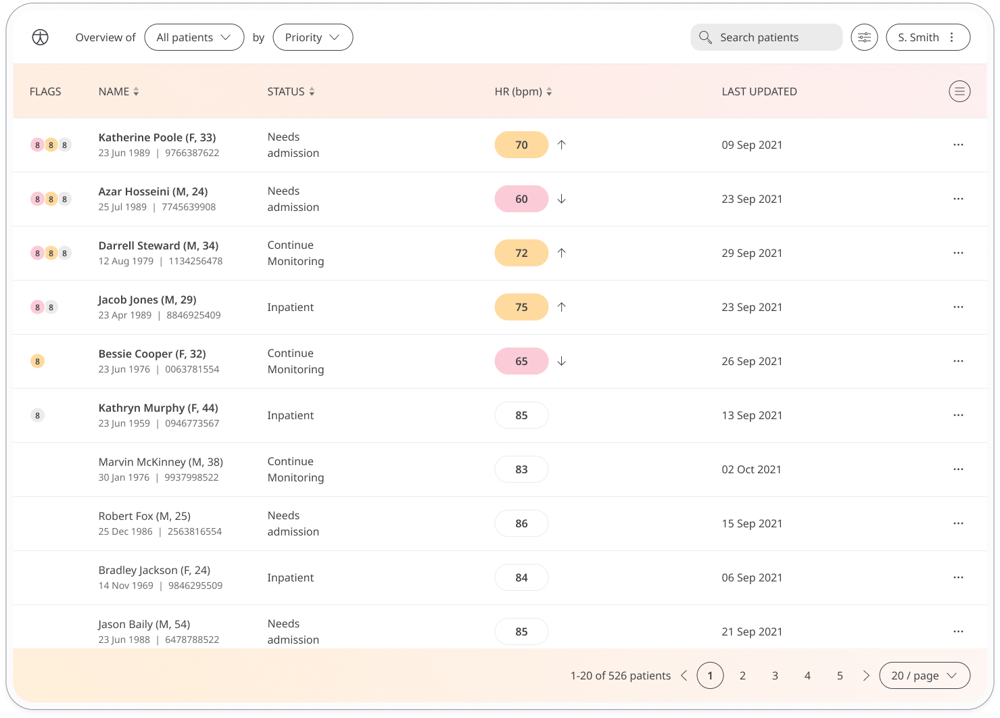
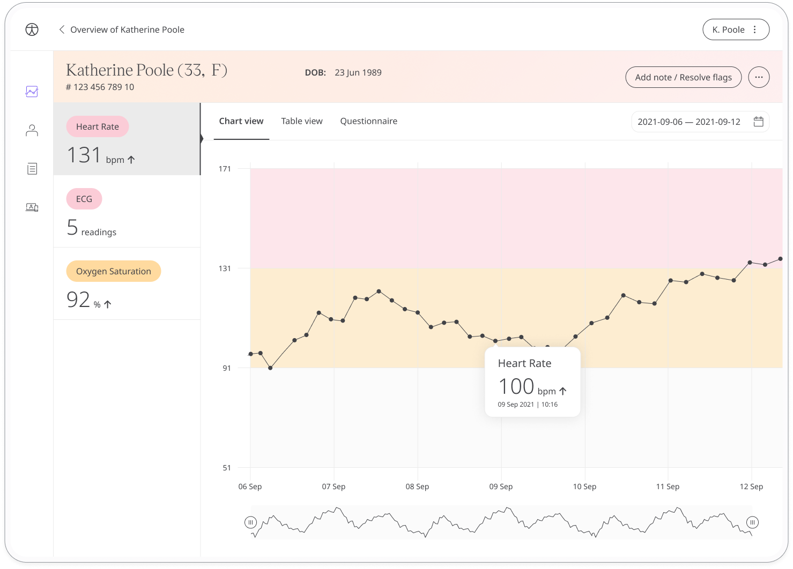

The Heart Rate module is used to record how many times a patient’s heart beats per minute. A healthy heart rate is between 60 and 100 bpm but can be affected by certain heart conditions, stress, anxiety, etc.

## How it works

Patients have a number of ways in which to collect their heart rate:

- connecting the Huma App to Apple Health or Google Fit
- taking the reading manually  
- using their smartphone camera to take the reading

Using the smartphone camera collection method also gives the user a heart rate variability and classification reading. When configuring the module, the admin can select which readings and sources should be available (maximum 2 sources per deployment).

The time and date is added automatically at the moment they make the entry (although this can be edited if needed). 

Patients can view their historic heart rate results in a graph. In the Clinician Portal, care teams will be able to easily see the latest heart rate readings from their patients and any concerning readings will be flagged.  

The Patient Summary displays a more detailed view of the patient's historic readings in graph or table form.

